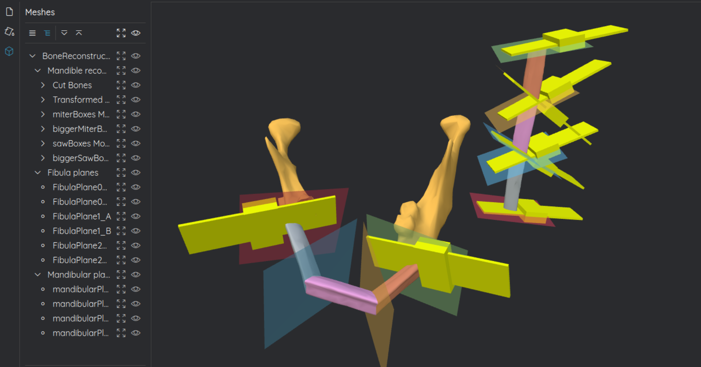
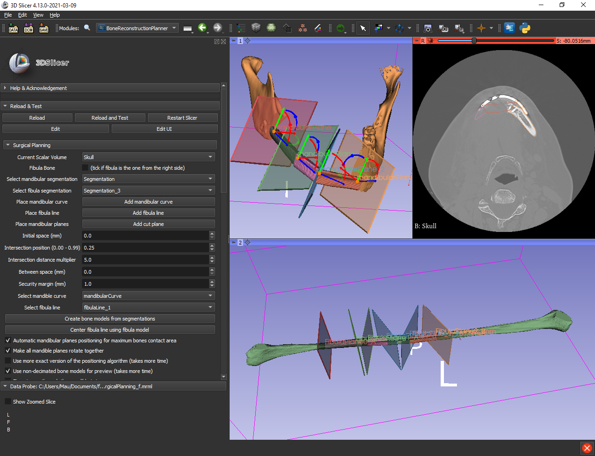
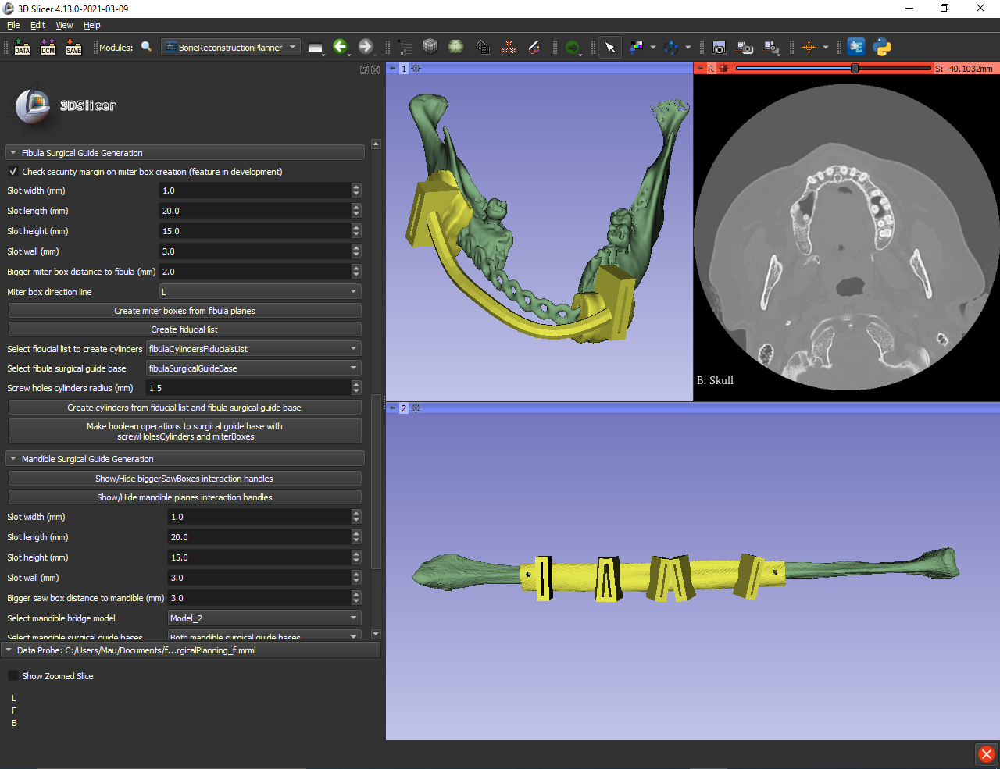

# Bone Reconstruction Planner


A 3D Slicer extension for virtual surgical planning of mandibular reconstruction with vascularized fibula free flap and generation of patient-specific surgical guides. 

# Interactive 3D demo

[Link here](https://3dviewer.net/index.html#model=https://github.com/SlicerIGT/SlicerBoneReconstructionPlanner/blob/main/BoneReconstructionPlanner.gltf). See a finished Virtual Surgical Plan of a mandibular reconstruction (i.e. 3D report).



# Screenshots

- Virtual Surgery Planning:



- Patient-specific Surgical Guides:




# Preview Video
 [](https://www.youtube.com/watch?v=wsr_g_1E_pw)

# Videotutorial
[](https://www.youtube.com/watch?v=g9Vql5h6uHM)

# Documentation
- [High-level design overview](https://github.com/SlicerIGT/SlicerBoneReconstructionPlanner/raw/main/Docs/Design.pptx)

# Use Cases
[First clinical use (Stonia)](https://github.com/SlicerIGT/SlicerBoneReconstructionPlanner/discussions/40)

[Use case by Manjula Herath (Sri Lanka)](https://discourse.slicer.org/t/bone-reconstruction-planner/19289)

[This one will be published as part of a case series next year (Malaysia)](https://github.com/SlicerIGT/SlicerBoneReconstructionPlanner/discussions/58)

# Description

Patient-specific guides dramatically improve the success rate and efficiency. 3D printing is revolutionizing reconstructive surgery by making it possible to construct patient-specific guides that are anatomically customized for each patient's need. Unfortunately, this technology is out of reach of most surgeons across the world due to the complexity and costs of existing solutions. The added cost of this technology, per case, is estimated to be around USD 3000 to USD 5000. Our ambition is to disrupt this market by providing an all-in-one cost-efficient and easy-to-use, open-source, and customizable software solution based on 3D Slicer, a free and open-source software package for image analysis and scientific visualization. The successful creation of this technology will enable the development of “patient and site-specific surgical guides”, manufactured through a combination of 3D planning and CAD/CAM. This solution will have the capacity to meet the complex needs of craniofacial reconstruction in a controlled manner. The outcome of the project will be an open-source solution that can make a 3D digital surgical plan that is transferred to the operating room via 3D-printed, patient-specific models, guides, and plates.

# Sample Data
- <a href="https://github.com/SlicerIGT/SlicerBoneReconstructionPlanner/releases/download/TestingData/CTFibula.nrrd" >Fibula Scalar Volume</a>
- <a href="https://github.com/SlicerIGT/SlicerBoneReconstructionPlanner/releases/download/TestingData/CTMandible.nrrd" >Mandible Scalar Volume</a>
- <a href="https://github.com/SlicerIGT/SlicerBoneReconstructionPlanner/releases/download/TestingData/FibulaSegmentation.seg.nrrd" >Fibula Segmentation</a>
- <a href="https://github.com/SlicerIGT/SlicerBoneReconstructionPlanner/releases/download/TestingData/MandibleSegmentation.seg.nrrd" >Mandible Segmentation</a>
- <a href="https://github.com/SlicerIGT/SlicerBoneReconstructionPlanner/releases/download/TestingData/TestPlanBRP.mrb" >Example Virtual Surgical Plan with Patient-Specific Surgical Guides</a>
- <a href="https://github.com/SlicerIGT/SlicerBoneReconstructionPlanner/releases/download/TestingData/TheoreticalPlanBRP_rib.mrb" >Theoretical Virtual Surgical Plan with a rib (Toy-example)</a>

# Instructions (last updated 09/30/2022)

## Installing BoneReconstructionPlanner

1. Download Slicer Preview Release from here: https://download.slicer.org/ It's version is 5.1.0 of that day.
2. Install Slicer
3. Open Slicer
4. Press Ctrl+4 to open the extension manager. Or click the upper-right icon with the letter 'E'
5. Go to 'Install Extensions' tab
6. On the upper-right search box write "BoneReconstructionPlanner"
7. Click install and give okay to install other extensions if asked (wait till ALL dependencies are installed completely).


## Segmentation (Preparation for Virtual Surgical Planning)

Make a mandible segmentation and a fibula segmentation.

Example:

0. CTs should have a recommended slice thickness of 0.65mm (or a maximum slice thickness of 1mm)
1. Go to the segment editor. Create a new segmentation. Create a new segment, name it 'fibula'.
2. Use threshold effect to select bone but not connecting tissue (like ligaments). Check if your selected threshold value is okay if there is no connection of the segmented bones near the joint. Threshold value should not be too low to not lose detail. Suggested value: 200
3. Use Islands effect, select 'keep selected island' and click over the fibula to keep it.
4. If successful continue. If not start over and use a higher threshold value or use scissors to isolate the fibula
5. Go to Wrap Solidify effect, on Advanced button set the suggested configuration below (by @SteveMaisi) and click apply. (This is needed because it is recommended that bone segmentations have no holes inside so the assisted miterBox positioning algorithms work well)

6. Restore the segmentation smoothing factor to 0.5

7. Correct errors on segmentations with scissors if needed.
8. The bone segment (fibula or mandible) should be the first of the segment-list of the segmentation. In other words the bone segment should be in position zero of the list.

## Virtual Surgical Planning

0. [Save](https://slicer.readthedocs.io/en/latest/user_guide/data_loading_and_saving.html#non-dicom-data) frequently as the surgical plan can be reopened from where you left it if there is a crash (software malfunction). We are trying to fix a bug that makes Slicer close unexpectedly ([more info here](https://github.com/SlicerIGT/SlicerBoneReconstructionPlanner/issues/63))
1. Click the search icon on the left of the module selector and write 'BoneReconstructionPlanner'. Click switch to module.
2. Select the mandibular segmentation and the fibula segmentation.
3. Click "Create bone models from segmentations"
4. Click "Add mandibular curve" and create a curve along the mandible. This will help giving the cut planes their initial position. It's a bit important to make it quite similar to the ideal mandible curve the patient would have if he was healthy because the plane positioning algorithms depend on it.
5. Click "Add cut plane" and click where you want plane. Add as many planes as needed. There will be a bone piece between every two adjacent planes. So the number of mandible planes should be the desired number of bone pieces for the reconstruction plus one. The first and the last mandible planes will be the mandible resection cuts.
6. Click "Add fibula line". Draw a line over the fibula on the 3D view. First point distal, last point proximal.
7. Click "Center fibula line using fibula model" to make the line be similar to the anatomical axis of the fibula.
8. Tick these options: "Automatic mandibular planes positioning for maximum bones contact area", "Make all mandible planes rotate together"
9. Click "Update fibula planes over fibula line; update fibula bone pieces and transform them to mandible" to make the reconstruction and create the fibula cut planes.
10. Move the mandible planes as desired to change the position/orientation of the cuts.
11. Click "Update fibula planes over fibula line; update fibula bone pieces and transform them to mandible" again. And repeat as many times as needed.
If you tick the button it will react on plane movements and update automatically.

## Personalized Fibula Guide Generation

1. Press shift over some fibula piece on the corresponding 3D view. The model should be visible on the 2D slice with the corresponding color as an edge. Create a line over the 2D slice of the fibula that will set the direction of the miterBoxes (with this you select, for example, lateral approach or posterior approach). The line should me drawn from the centerline of the fibula to a point that is distal from the first one on the 2D slice of the fibula.
2. Select the parameters of the miter boxes: lenght, width, height, wall thickness and tolerance (this last option is inside the Settings widget and it applies also to sawBoxes of the mandible). The combination of tolerance and the slot width suggested by most experienced user (@mrtig) is:

```
It's easy to find out what good fit for the saw blade is by printing a few pockets with different widths. It depends on the printing technology. There is a summary at the end.

The saw blade used on this example is 0.2mm. If I print using the SLA printer I make the pockets 0.3 mm. With the FDM printer the width needs to be 0.6 mm. And the default tolerance is 0.2mm

These are the equations:

Suggested sawBoxSlotWidths
If SLA is used:
sawBoxSlotWidth = sawBladeWidth + 0.1mm
else if FDM is used:
sawBoxSlotWidth = sawBladeWidth + 0.4mm

realSawBoxWidth = sawBoxSlotWidth+2*clearanceFitPrintingTolerance

So for this example we have:
If SLA is used:
realSawBoxWidth = sawBladeWidth + 0.1mm +2*clearanceFitPrintingTolerance = 0.2mm + 0.1mm + 2*0.2mm = 0.7mm
else if FDM is used:
realSawBoxWidth = sawBladeWidth + 0.4mm +2*clearanceFitPrintingTolerance = 0.2mm + 0.4mm + 2*0.2mm = 1.0mm

From these we can find the realClearanceFitPrintingTolerance (that should be used with the realSawBoxWidth) as:
If SLA is used:
realClearanceFitPrintingTolerance = (realSawBoxWidth - sawBladeWidth)/2 = (0.7mm - 0.2mm)/2 = 0.25mm
else if FDM is used:
realClearanceFitPrintingTolerance = (realSawBoxWidth - sawBladeWidth)/2 = (1.0mm - 0.2mm)/2 = 0.4mm

As a summary:
You should use these equations
- sawBoxWidth = sawBladeWidth
- If SLA is used:
clearanceFitPrintingTolerance = 0.25mm
else if FDM is used:
clearanceFitPrintingTolerance = 0.4mm

```


3. Click "Create miter boxes from fibula planes". The yellow miterBoxes will appear, each one with a long box that will create the slit for the saw to go through.

# Create the Fibula Guide Base
3. Go to the segment editor, add a new segment and create a copy (using the copy-logical-operator) of the fibula segment, rename it to "fibGuideBase".
4. Use Hollow tool with "inside surface" option and some "shell thickness" between 3 to 6mm. The number should be decision of the user. Usually more thickness makes the contact between the miterBoxes and the guideBase easier to achieve but sometimes the guideBase ends up too big wasting material or being uncomfortable. You can solve this, using a smaller shell if you do "masked painting" in the areas that need filling.
[Here is explained how to do it](https://github.com/SlicerIGT/SlicerBoneReconstructionPlanner/discussions/40#discussioncomment-1607995)
5. Go to the data module and leave only the fibGuideBase segment visible on its segmentation, right-click it and press "Export visible segments to models"

# Finish the Fibula Surgical Guide
6. On the "Fibula Surgical Guide Generation" layout of BRP click on the button "Create fiducial list" and position around one point per segment were you want the screw-hole to be (the fibGuideBase model should be visible).
7. Select the fibula guide base model that you exported on the corresponding model selector. Be sure the correct pointList is selected on the corresponding point selector. If you go by defaults it should work fine.
8. Click "Create cylinder from fiducial list and fibula surgical guide base". Some cylinders should appear over the fibula guide base.
9. Congratulations: You are ready to execute boolean operations to create the guide. Click on "Make boolean operations to surgical guide base with screwHolesCylinders and miterBoxes". The guide will be created, you can be sure by using the NodeControlBox that is above and hiding everything else by clicking each "eye icon" of the component objects. The name of the guide will end with the word "Prototype". If you execute this button again after you did some changes to the plan (e.g. changed miterBoxes position) a new prototype will be created.

## Personalized Mandible Surgical Guide.

The workflow doesn't differ much from fibula guide creation.
Except that:
- The sawBoxes are movable and you should only move them inside the cut plane, to correct automatic mispositioning. After that hide the "biggerSawBoxes interaction handles" so you have a comfortable experience on later steps.
- You need to segment two guide bases, one for each planar cut, and copy them together to the same segment. Then export them as a unique model as explained on the earlier section.
- You may like to create a bridge between both mandibleGuides to make a rigid connection between them. This is done with the module "MarkupsToModel" and it's very easy to use.
- You need to put the correct models on the corresponding selectors on "Mandible Surgical Guide Generation" panel

## Mandible Reconstruction Simulation
1. Do a Virtual Surgical Plan
2. Click "Create 3D model of the reconstruction for 3D printing". This button maybe useful for users that want to prebent plates.

## User contributions and feedback

Fell free to open an [issue](https://github.com/SlicerIGT/SlicerBoneReconstructionPlanner/issues/new) (yes, you need a Github account) if you find the instructions or the videotutorial inaccurate, or if you need help finishing the workflow

# License
- <a href="https://github.com/SlicerIGT/SlicerBoneReconstructionPlanner/blob/main/LICENSE" >Read license</a>
